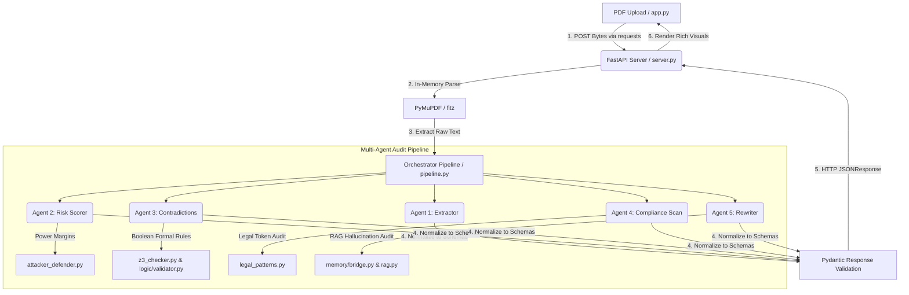

# ⚖️ RegulAIte — AI-Driven Corporate Legal Document Auditor

RegulAIte is a state-of-the-art corporate legal document auditor and risk-mitigation system. Built on a modular, high-performance architecture, it combines a **FastAPI backend** running an advanced **5-Agent AI Orchestration pipeline** with a **Z3 Constraint Solver** logic validation engine, a **Vector RAG Memory** subsystem, and a **rich, interactive Streamlit frontend** dashboard.

Whether running dynamically against live cloud LLM providers or executing in local offline fallback sandbox environments, RegulAIte offers bulletproof stability, comprehensive audits, and seamless micro-animated legal intelligence.

---

## 🧠 Core Concept & Legal-Technical Theory

Corporate contracts are the structural skeleton of business relationships, yet they are notoriously vulnerable to human oversight. High-velocity commercial environments suffer from three critical problems:
1. **Deceptive Asymmetries**: Subtle legal language shifts uncapped liability to vendors, imposes unilateral termination rights, or claims pre-existing intellectual property without fair carve-outs.
2. **Internal Logical Clashes**: Multi-page drafting errors create contradictory terms—such as stating invoices are paid in *Net 30* in Section 3, but designating premium tier invoice settlements as *Net 15* in Schedule B.
3. **AI Hallucinations**: Standard Generative AI bots auditing contracts often fabricate clauses or make factually unsupported claims about the text.

RegulAIte resolves these challenges by bridging **cognitive generative modeling** with **mathematical formal verification** and **fact-grounded vector memories**.

---

### 1. The Multi-Agent Cognitive Framework (5-Agent Audit Pipeline)
Instead of relying on a single monolithic LLM prompt, RegulAIte employs a **directed 5-Agent pipeline** where each agent possesses a distinct legal-counsel persona, cooperating sequentially to perform a high-fidelity audit:

```
                  ┌──────────────────────┐
                  │ 📝 1. CLAUSE EXTRACTOR│
                  └──────────┬───────────┘
                             │ (JSON Blocks)
                             ▼
                  ┌──────────────────────┐
                  │ ⚡ 2. RISK SCORER     │
                  └──────────┬───────────┘
                             │ (Problem Clauses & Severities)
                             ▼
                  ┌──────────────────────┐
                  │ 🔍 3. CONTRADICTION  │
                  └──────────┬───────────┘
                             │ (Conflict Pairs & Rules)
                             ▼
                  ┌──────────────────────┐
                  │ 🛡️ 4. COMPLIANCE SCAN │
                  └──────────┬───────────┘
                             │ (Jurisdictional Audits)
                             ▼
                  ┌──────────────────────┐
                  │ 🩹 5. AUTO-REWRITER  │
                  └──────────────────────┘
```

- **Agent 1: Clause Extractor (`extractor.py`)**  
  *Role*: Structural Parser. Isolates raw contract text into discrete, logically indexed JSON clause objects.
- **Agent 2: Risk Scorer & Strategist (`risk_scorer.py`)**  
  *Role*: Adversarial Auditor. Analyzes contract provisions to compute severity scores (1-10) and flags operational exposures. It invokes **`attacker_defender.py`** to simulate a high-stakes negotiation debate, revealing hidden leverage points and strategic defense scripts.
- **Agent 3: Contradiction Auditor (`contradiction.py`)**  
  *Role*: Inconsistency Spotter. Scans clauses for conflicting terms, specifically focusing on dates, payment windows, and liability limits.
- **Agent 4: Compliance Auditor (`compliance.py`)**  
  *Role*: Regulatory Sentinel. Scans the agreement against regional policies like the Reserve Bank of India (RBI) outsourcing rules, GDPR data retention clauses, and CCPA privacy mandates.
- **Agent 5: Legal Rewriter (`rewriter.py`)**  
  *Role*: Mitigation Engineer. Acts as the "Auto-Fixer," drafting neutral, non-prejudicial, commercially balanced alternative phrasing to replace flagged high-risk terms.

---

### 2. Formal Mathematical Verification (Z3 Constraint Solver)
To guarantee complete logical accuracy and prevent false alarms, RegulAIte utilizes Microsoft Research's **Z3 Constraint Solver** (`z3-solver`). 

Natural language is often ambiguous, but legal terms can be translated into formal logical constraints. For example, timeline requirements are modeled mathematically:
- Let $D_{payment}$ be the number of days allowed to settle an invoice.
- Let $D_{notice}$ be the convenience termination notice period.
- Clause A states: *"Invoices must be settled within 15 days."* $\implies D_{payment} \le 15$
- Clause B states: *"Invoices are settled on a Net 30 basis."* $\implies D_{payment} = 30$

The **`logic/validator.py`** parser utilizes regex patterns (**`logic/patterns.py`**) to translate these natural language clauses into symbolic Z3 boolean variables. It then sets up a logical system:
$$\text{System} = (D_{payment} \le 15) \land (D_{payment} = 30)$$

When Z3 evaluates this model, it performs **Satisfiability Modulo Theories (SMT)**:
- If Z3 returns `sat` (Satisfiable), the conditions can co-exist without conflict.
- If Z3 returns `unsat` (Unsatisfiable), **Z3 mathematically proves that a logical contradiction exists**, rendering the contract physically impossible to comply with. RegulAIte captures this proof and highlights the conflicting clauses in the UI.

---

### 3. Anti-Hallucination Guarding (Vector RAG Memory)
To shield the audit from generative errors, the **`memory/`** subsystem implements an in-memory RAG database:
- **Vector Embedding space**: Document clauses are embedded via `sentence-transformers` (or an optimized, local TF-IDF vector matrix fallback if offline).
- **HALLUCINATION SHIELD (`memory/bridge.py`)**: When any agent flags a clause, RegulAIte executes a vector search query. It measures the cosine similarity between the agent's citation text and the raw contract text. If the similarity score falls below a strict threshold, the claim is flagged as ungrounded (protecting the user from AI fabrications).
- **Citation Dependency Graph (`citation_graph.py`)**: Models clause-to-clause references (e.g., *"Subject to Section 4.2..."*) as a Directed Acyclic Graph (DAG) using `networkx`. This enables the user to visualize the cascading impact of editing any specific clause.

---

## 🛠️ Technology Stack

### 🖥️ Frontend (Interactive Dashboard)
- **Core Framework**: [Streamlit](https://streamlit.io/) (for state-managed real-time dashboards)
- **Primary LLM Integration**: [Google Generative AI SDK](https://github.com/google/generative-ai-python) (utilizing `gemini-1.5-flash` for high-speed dynamic local scans)
- **Document Handlers**: 
  - `PyPDF` (for fast in-memory text parsing of client-uploaded contracts)
  - `ReportLab` (for high-fidelity legal audit report compilation and PDF downloads)
- **Styling & UI**: Vanilla CSS injected grids, custom Inter typography, harmonized tone alerts, and glassmorphic micro-animations.

### ⚙️ Backend (AI Multi-Agent Pipeline & Engines)
- **API Framework**: [FastAPI](https://fastapi.tiangolo.com/) + `Uvicorn` (asynchronous loop high-performance HTTP server)
- **Orchestration Brain**: [Anthropic Python SDK](https://github.com/anthropics/anthropic-sdk-python) (utilizing `claude-sonnet-4-20250514` for industry-standard professional legal reasoning)
- **In-Memory Text Engine**: `PyMuPDF` (`fitz` for fast parsing of incoming PDF streams without writing to local disks)
- **Logic Validation**: `z3-solver` (Microsoft Research's formal verification logic engine to mathematically prove clause conflicts and scheduling inconsistencies)
- **Memory & Grounding Subsystem**:
  - `sentence-transformers` + `numpy` (local vector embeddings and cosine-similarity searches to ground claims and detect hallucinations)
  - `networkx` (Directed Acyclic Graphs (DAG) modeling and visualizing cross-clause citation networks)

---

## 📂 Project Architecture & Directory Layout

The workspace is organized to keep frontend code strictly isolated at the root level, and backend modules consolidated within the `/backend` container:

```
regulaite-ai/
├── app.py                      # Main Streamlit Frontend Dashboard & Interactive UI
├── mock_data.py                # Predefined simulation structures & fallback data payloads
├── requirements.txt            # Unified dependencies file for both Backend & Frontend
├── .env.example                # Template for server port configurations and API keys
├── start.bat                   # Unified Windows script launcher for Backend & Frontend
│
├── backend/                    # Consolidated FastAPI Backend System
│   ├── server.py               # Main FastAPI entry point (exposes health, analyse, and clause stores)
│   ├── schemas.py              # Pydantic schemas validating API requests & responses
│   ├── test_pipeline.py        # Console-safe smoke test suite for backend pipeline evaluation
│   │
│   ├── ai_orchestration/       # Multi-Agent Coordination Subsystem
│   │   ├── pipeline.py         # Main execution coordinator linking all 5 agents & memory
│   │   ├── agents/             # Modular cognitive agents with specific legal personas
│   │   │   ├── extractor.py    # Agent 1: Extracts structured legal clauses from raw text
│   │   │   ├── risk_scorer.py  # Agent 2: Scores risk (1-10) and compiles verbatim problematic items
│   │   │   ├── contradiction.py# Agent 3: Identifies plain-text inconsistencies
│   │   │   ├── compliance.py   # Agent 4: Performs compliance scans against target policies (GDPR/RBI)
│   │   │   └── rewriter.py     # Agent 5: Generates counter-proposed balanced rewrites (Auto-Fixer)
│   │   └── tools/              # Specialized tools consumed by agents
│   │       ├── attacker_defender.py  # Computes negotiation margins and power imbalances
│   │       ├── legal_patterns.py     # Legal vocabulary token dictionaries
│   │       ├── rag_verifier.py       # Mini vector RAG indexes for grounding claims
│   │       └── z3_checker.py         # Interfaces with the Z3 validator
│   │
│   ├── logic/                  # Z3 Logic Consistency Subsystem
│   │   ├── validator.py        # Translates legal conditions into logical rules and executes Z3 Solver
│   │   └── patterns.py         # Regular expression maps for converting clauses to Z3 boolean rules
│   │
│   └── memory/                 # Semantic Grounding & Citation Network Subsystem
│       ├── bridge.py           # Evaluates LLM statements against vector RAG index (detects hallucinations)
│       ├── rag.py              # Custom in-memory TF-IDF/Vector similarity search
│       └── citation_graph.py   # Models references and cross-citations as Directed Acyclic Graphs (DAG)
```

---

## 🔗 Code Linkages & Dynamic Data Flow

Here is a mapping of how each component is linked and how data flows through the system during a contract audit:



### In-Depth Execution Step-by-Step:
1. **Frontend File Upload**: In **`app.py`**, when a user drops a contract PDF into the sidebar, the frontend automatically checks if the local FastAPI backend is active. 
2. **API Connection & Integration**: The Streamlit frontend performs a `POST` request via the `requests` library to `http://localhost:8000/analyse` containing the raw PDF bytes.
3. **Text Extraction**: The FastAPI endpoint inside **`backend/server.py`** processes the uploaded file, utilizing `fitz` (PyMuPDF) to extract the raw text directly in-memory, ensuring zero disk overhead.
4. **Pipeline Execution**: The server calls `run_pipeline()` in **`backend/ai_orchestration/pipeline.py`**, triggering the five specialized agents:
   - **`extractor.py`** splits the raw document text into distinct, logically-mapped clauses.
   - **`risk_scorer.py`** assigns a severity rating (1-10) to each clause and determines a negotiation score via the **`attacker_defender.py`** playbook.
   - **`contradiction.py`** compiles plain-text incompatibilities. To back up its findings mathematically, it interfaces with **`logic/validator.py`**, which maps payment windows or timelines (e.g. Net 15 vs. Net 30) into boolean symbols and feeds them into the **`Z3 Solver`** to formally verify internal logical contradictions.
   - **`compliance.py`** matches clauses against jurisdiction-specific policies (like RBI, GDPR, CCPA).
   - **`rewriter.py`** automatically drafts balanced, non-prejudicial rewrites for risky clauses, empowering users to click and replace.
   - **`memory/bridge.py`** sets up a vector index via **`rag.py`** to perform cosine similarity searches, cross-referencing AI outputs against the source text to prevent AI hallucinations, and maps citations inside a **`citation_graph.py`** NetworkX DAG.
5. **UI Rendering**: The FastAPI server normalizes all multi-agent outputs, validates them against Pydantic models in **`backend/schemas.py`**, and returns a structured payload. Streamlit displays this raw data in interactive cards, Z3 formal proof reports, dynamic negotiation debate logs, and citation graphs.

---

## 🛡️ Robust Fail-Safe Design (Offline Stub Modes)

RegulAIte is engineered to be **production-grade**, providing graceful fallbacks at every stage of execution so the interface remains fully operational even under constraints:

1. **No Backend Connection**: If the FastAPI backend is not booted, the frontend `app.py` automatically falls back to its own in-memory execution engine. If a Gemini API Key is provided, it runs a live Gemini analysis. If no key is set, it activates high-fidelity content-aware rules that scan for exact risk profiles (fully tailored for perfect, mild, or vulnerable agreements).
2. **Missing Backend API Keys**: If `ANTHROPIC_API_KEY` is not present in `.env`, the FastAPI backend runs in **Stub Mode**. It returns highly realistic, rich multi-agent assessment payloads. This allows developers to test the full pipeline and interface integration without consuming API credits.
3. **Missing Optional Libraries**: If complex scientific dependencies (`z3-solver` or `sentence-transformers`) are not natively present in the target environment, the backend automatically transitions to optimized, lightweight mathematical equivalents (such as polarity contradiction vectors and clean heuristic logic maps) to execute the audit successfully without throwing exceptions.

---

## 🚀 Installation & Launch Instructions

### 1. Configure the Environment
Create your local environment configuration by copying the template file in the project root:
```powershell
copy .env.example .env
```
Open `.env` in a text editor and provide your Anthropic API Key (or leave empty to trigger **Stub Mode**):
```env
ANTHROPIC_API_KEY=sk-ant-your-key-here
SERVER_PORT=8000
```

### 2. Run the Unified Launcher
To boot both servers simultaneously on Windows, simply double-click the launcher script or execute it from your shell:
```powershell
start.bat
```
The unified launcher will automatically:
1. Verify and install any missing python libraries silently via `pip install -r requirements.txt`.
2. Start the **FastAPI Backend Server** on **`http://localhost:8000`** in a background terminal.
3. Wait briefly for the backend to initialize, then launch the **Streamlit Frontend Dashboard** on **`http://localhost:8501`**.
4. Open the active dashboard in your default web browser automatically.

---

## 🧪 Pipeline Smoke Testing

To test the backend multi-agent pipeline and Z3 solver imports directly in the console without spinning up the network server, run:
```powershell
cd backend
python test_pipeline.py
```
A successful execution will verify imports, logic loops, citation graphs, and print a comprehensive verification checklist:
```text
============================================================
RegulAIte AI Orchestration Pipeline Test
============================================================
[1] Running pipeline on 9-clause test contract...
[2] Checking required keys...
  [OK] score: 15
  [OK] verdict: Low Risk
  [OK] summary: This contract has an overall risk score of 15/100...
  ...
============================================================
PIPELINE TEST OK
============================================================
```

---

## 🚀 Production Deployment Checklist

To deploy **RegulAIte-AI** to production for B2B enterprise consumption, you have two primary deployment architectures:

### Option A: Standard Single-Instance Cloud VPS (Recommended)
You can deploy both servers on a single standard cloud instance (e.g. AWS EC2, DigitalOcean Droplet, GCP VM) running Linux (Ubuntu 22.04 LTS):
1. **Clone & Setup**:
   ```bash
   git clone https://github.com/Shashankcodelover/regulaite-ai.git
   cd regulaite-ai
   python3 -m venv .venv
   source .venv/bin/activate
   pip install -r requirements.txt
   ```
2. **Production Process Management**:
   Use **PM2** or standard **Systemd Services** to run the services in the background and auto-restart them on crash:
   * **FastAPI Backend Service**: `uvicorn backend.server:app --host 0.0.0.0 --port 8000`
   * **Streamlit Frontend Dashboard**: `streamlit run app.py --server.port 8501 --server.address 0.0.0.0`
3. **Nginx Reverse Proxy & SSL**:
   Configure Nginx as a reverse proxy, mapping domain name paths to the Streamlit and FastAPI ports, and install a free SSL certificate via **Certbot (Let's Encrypt)**.

### Option B: Containerized Docker Deployment
RegulAIte is fully Docker-compatible. You can run it via a simple multi-container orchestrator:
1. **Dockerfile (Frontend & Backend)**.
2. **docker-compose.yml** to spin up both containers concurrently with isolated networks.

---

## 📁 Git Configuration & Readiness

The repository is configured with a thorough `.gitignore` excluding all local cache files (`__pycache__`), virtual environments (`.venv`), temporary user configuration settings (`.env`), system files, and dynamic PDF uploads. It is **100% clean and ready to push** to your remote GitHub repository!
